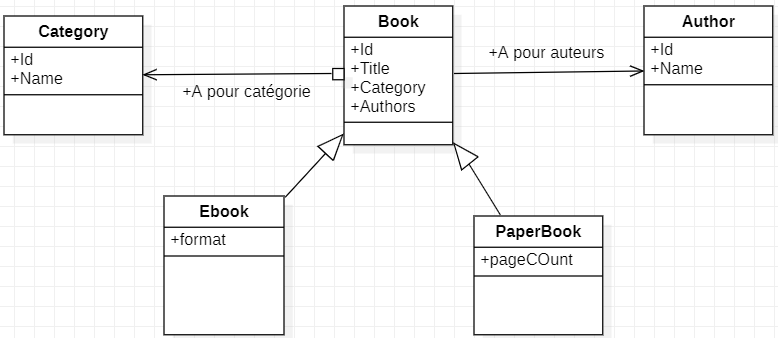

# TP JPA/Hibernate

L'objectif de ce TP est de découvrir l'accès à des données persistantes en Java à l'aide d'un framework de persistance JPA (Object Relational Mapping standardisé) utilisant une implémentation Hibernate.

Pendant ce TP vous aurez à:
 - définir une partie du mapping
 - développer un Repositorie ou DAO
 - développer quelques manipulations des objets dans le Main pour valider votre travail et expérimenter le framework
 - observer ce qui est produit par le framework en SQL
 - réaliser des manipulations de base Maven pour tester votre travail

## Contexte

Le cas d'utilisation est très simple. Il consiste en 3 entités principales: Book, Category, Author. Une Livre possède une et une seule catégorie. Un livre est associé à un ensemble d'auteurs. Un auteur est lui aussi associé potentiellement à un ensemble de livre, mais ce lien directionnel n'est pas intéressant dans l'application et ne sera pas représenté.
Deux autres entités sous-classe de Book sont définis: PaperBook et Ebook.

Vous aurez à représenter le mapping pour les relations d'associations et d'héritage.

Chaque classe dispose d'un DAO pour gérer l'accès JPA et d'un service pour l'accès au niveau.  L'application utilisera les services pour manipuler les données.
A noter qu'un ensemble de classes de test sont définis afin de valider votre travail.

## Installation

Vous devrez forker le projet Git mis à disposition, puis le cloner pour le partager avec moi.
Le projet se base sur Java 17 au moins. Tous les dépendances sont gérées par Maven.
Vous devez juste pour valider votre installation faire:
 - mvn clean
 - mvn install

Ensuite vous pourrez réaliser les tests:
 - mvn test
 - mvn test -Dtest=CategoryDAOTest (pour réaliser une classe de test spécifique)

Le projet est configuré pour s'executer sur une base H2 en mémoire.

## Réalisation

Vous trouverez dans:
 - /data le modèle de données avec le mapping
 - /dao les classes DAO d'accès JPA
 - /service les classes pour l'accès application aux données
 - /test les classes de tests
 - /ressources/META-INF contient le fichier persitence.xml pour configurer la connection au SGBD

Le code lié à Category et Author est déjà réalisé  (data, dao, service).
Vous devrez, en suivant les commentaires dans le code:
 - compléter Book.java avec les bonnes annotations
 - compléter PaperBook.java et Ebook.java avec les annotations d'héritage
 - compléter le code des méthodes de BookDAO.java en vous inspirant de CategoryDAO et AuthorDAO
 - valider votre travail à l'aide des tests définis (BookDAOTest)
 
 Vous devrez utiliser les traces d'execution JPA sur la console pour comprendre mieux ce qui a été généré:
  - Quelle sont les tables crées et leur relations (PK, FK) ?
  - Quelles sont les requêtes générées et le lien avec le code des DAO ?

  Quand votre mapping et DAO seront validés, vous pourrez réaliser le codage de qqs manipulations:
  - en suivant les commentaires dans Main.java afin de tester vos services en lecture/écriture
  - en observant les traces d'execution SQL généré par JPA

## Test Oracle

Vous pourrez tester votre projet sur la base Oracle de l'UFR.
Le répertoire /ressources/META-INF contient le fichier de configuration persistence.xml qui permet de configurer l'accès à un SGBD.
Deux fichiers sont également définis que vous pourrez renommer en persistence.xml
 - persistence_H2.xml pour l'accès H2
 - persistence_Oracle.xml pour l'accès Oracle

Il vous suffit d'utiliser le contenu du fichier de configuration Oracle pour tester le projet avec Oracle, en prenant utilisant le VPN si besoin. Vous pourrez ainsi observer le shéma créé après exécution du projet.

## Rendu du TP

Vous m'ajouterez à votre projet Git pour que je puisse accéder à votre code (Github: fjouanot, Gitlab: jouanotf).